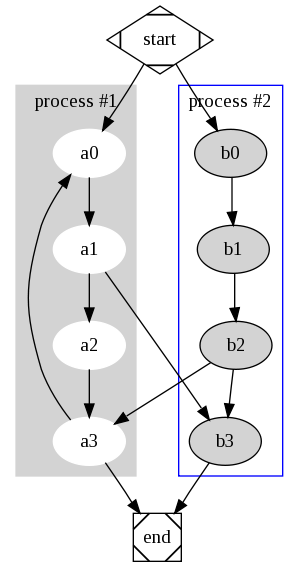

Statically compiled Graphviz dot (dot_static, x64)
======

Truly statically compiled `dot` binary for Linux x86_64. Supports SVG output and HTML node labels (via expat). No runtime dependencies — works on any Linux x64 system (Debian, Ubuntu, Alpine, etc.).

**Graphviz version:** 12.2.1 (compiled Feb 2026)

## Features

- **SVG output** with plaintext and HTML labels
- **Truly static binary** — no dynamic linker, no shared libraries needed
- **2.6MB** stripped binary size
- **OS-aware bootstrap** (`bootstrap.php`) auto-detects macOS Homebrew or Linux bundled binary
- **Client-side fallback** (`client/dot-client.js`) renders graphs in the browser via [viz-js](https://github.com/mdaines/viz-js) (WASM)

## Graphviz

**Graph visualization** is a way of representing structural information as diagrams of abstract graphs and networks. It has important applications in networking, bioinformatics, software engineering, database and web design, machine learning, and in visual interfaces for other technical domains.

The [Graphviz layout programs](http://www.graphviz.org/) take descriptions of graphs in a simple text language, and make diagrams in useful formats, such as images and SVG for web pages; PDF or Postscript for inclusion in other documents; or display in an interactive graph browser.

**So;**

```
digraph G {

	subgraph cluster_0 {
		style=filled;
		color=lightgrey;
		node [style=filled,color=white];
		a0 -> a1 -> a2 -> a3;
		label = "process #1";
	}

	subgraph cluster_1 {
		node [style=filled];
		b0 -> b1 -> b2 -> b3;
		label = "process #2";
		color=blue
	}
	start -> a0;
	start -> b0;
	a1 -> b3;
	b2 -> a3;
	a3 -> a0;
	a3 -> end;
	b3 -> end;

	start [shape=Mdiamond];
	end [shape=Msquare];
}
```

**...becomes:**



### dot command

**dot** can be used to create ``hierarchical'' or layered drawings of directed graphs. This is the default tool to use if edges have directionality. dot aims edges in the same direction (top to bottom, or left to right) and then attempts to avoid edge crossings and reduce edge length.

This package contains statically compiled version(s) of dot (self contained versions, which dont have dependencies on additional system libraries). These can simply be uploaded to a webserver in order to use dot without root/installation privileges.

## Installation

```bash
composer require restruct/dot-static
```

Make sure the `vendor/restruct/dot-static/x64/dot_static` executable has executable permissions (`chmod +x` / 744). This permission is set on the file in the repo but doesn't always seem to get transferred properly when uploading via FTP.

For local development on macOS, simply install dot using Homebrew (`brew install graphviz`) and use that instead. The bootstrap auto-detects this.

### PHP usage

```php
// Auto-detect path (macOS Homebrew or Linux bundled binary)
require 'vendor/restruct/dot-static/bootstrap.php';
$dotPath = GRAPHVIZ_DOT_PATH;

// Or via the class wrapper
use DotStatic\DotStatic;
$dotPath = DotStatic::getPath();
if (DotStatic::isAvailable()) {
    exec("$dotPath -Tsvg input.dot -o output.svg");
}
```

### Client-side usage (browser)

For rendering graphs in the browser without a server binary, include the client-side wrapper which uses [viz-js](https://github.com/mdaines/viz-js) (Graphviz compiled to WebAssembly):

```html
<!-- Auto-renders all elements with data-dot-graph attribute -->
<script type="module" src="vendor/restruct/dot-static/client/dot-client.js"></script>

<div data-dot-graph="digraph { a -> b }"></div>
```

Or programmatically:

```javascript
const svg = await DotClient.renderString('digraph { a -> b }');
document.body.appendChild(svg);
```

## Building the static binary

The binary is built reproducibly via Docker (Alpine/musl). See **[build/README.md](build/README.md)** for full build instructions, how it works, and lessons learned.

## License

* This 'Object code': MIT
* Source code: Eclipse Public License - v 1.0
